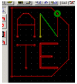



## PCB Editor

### Description

This is a functional OO PCB editor, great code, please comment and vote.
 
### More Info
 

             |
---                |---
**Submitted On**   |2003-10-26 03:53:18
**By**             |[Dante Milano Souto](https://github.com/Planet-Source-Code/PSCIndex/blob/master/ByAuthor/dante-milano-souto.md)
**Level**          |Advanced
**User Rating**    |4.8 (81 globes from 17 users)
**Compatibility**  |VB 6\.0
**Category**       |[Complete Applications](https://github.com/Planet-Source-Code/PSCIndex/blob/master/ByCategory/complete-applications__1-27.md)
**World**          |[Visual Basic](https://github.com/Planet-Source-Code/PSCIndex/blob/master/ByWorld/visual-basic.md)
**Archive File**   |[PCB\_Editor16638910272003\.zip](https://github.com/Planet-Source-Code/dante-milano-souto-pcb-editor__1-49477/archive/master.zip)

